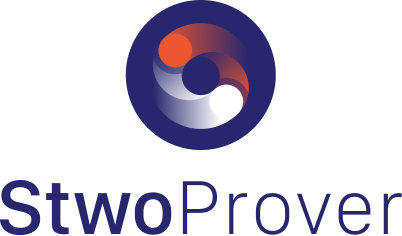

  <h3>
    <a href="https://eprint.iacr.org/2024/278">
      Paper
    </a>
     | 
    <a href="https://github.com/starkware-libs/stwo">
      Documentation
    </a>
     | 
    <a href="https://starkware-libs.github.io/stwo/dev/bench/index.html">
      Benchmarks
    </a>
  </h3>

# Stwo

## 🌟 About

Stwo is a next generation implementation of a [CSTARK](https://eprint.iacr.org/2024/278) prover and verifier, written in Rust 🦀.

> **Stwo is a work in progress.**
>
> It is not recommended to use it in a production setting yet.

## 🚀 Key Features

- **Circle STARKs:** Based on the latest cryptographic research and innovations in the ZK field.
- **High performance:** Stwo is designed to be extremely fast and efficient.
- **Flexible:** Adaptable for various validity proof applications.

## 📊 Benchmarks

Benchmarks can be run using `cargo bench`.

Visual representation of benchmarks can be found [here](https://starkware-libs.github.io/stwo/dev/bench/index.html).

## 📜 License

This project is licensed under the **Apache 2.0 license**.

See [LICENSE](LICENSE) for more information.

## ✨ Contributors

Thanks goes to these wonderful people:

<!-- ALL-CONTRIBUTORS-LIST:START - Do not remove or modify this section -->
<!-- prettier-ignore-start -->
<!-- markdownlint-disable -->
<table>
  <tbody>
    <tr>
      <td align="center" valign="top" width="14.28%"><a href="https://github.com/spapinistarkware"> <b>Shahar Papini</b></a> <a href="https://github.com/starkware-libs/stwo/commits?author=spapinistarkware" title="Code">💻</a></td>
      <td align="center" valign="top" width="14.28%"><a href="https://github.com/shaharsamocha"> <b>shaharsamocha</b></a> <a href="https://github.com/starkware-libs/stwo/commits?author=shaharsamocha" title="Code">💻</a></td>
      <td align="center" valign="top" width="14.28%"><a href="https://github.com/andrewmilson"> <b>Andrew Milson</b></a> <a href="https://github.com/starkware-libs/stwo/commits?author=andrewmilson" title="Code">💻</a></td>
      <td align="center" valign="top" width="14.28%"><a href="https://github.com/alonh5"> <b>Alon Haramati</b></a> <a href="https://github.com/starkware-libs/stwo/commits?author=alonh5" title="Code">💻</a></td>
      <td align="center" valign="top" width="14.28%"><a href="https://github.com/ohad-starkware"> <b>Ohad</b></a> <a href="https://github.com/starkware-libs/stwo/commits?author=ohad-starkware" title="Code">💻</a></td>
      <td align="center" valign="top" width="14.28%"><a href="https://github.com/alon-dotan-starkware"> <b>alon-dotan-starkware</b></a> <a href="https://github.com/starkware-libs/stwo/commits?author=alon-dotan-starkware" title="Code">💻</a></td>
      <td align="center" valign="top" width="14.28%"><a href="https://www.chenweikeng.com/"> <b>Weikeng Chen</b></a> <a href="https://github.com/starkware-libs/stwo/commits?author=weikengchen" title="Code">💻</a></td>
    </tr>
    <tr>
      <td align="center" valign="top" width="14.28%"><a href="https://github.com/suiwater"> <b>water</b></a> <a href="https://github.com/starkware-libs/stwo/commits?author=suiwater" title="Code">💻</a></td>
      <td align="center" valign="top" width="14.28%"><a href="https://github.com/carlogf"> <b>carlogf</b></a> <a href="https://github.com/starkware-libs/stwo/commits?author=carlogf" title="Code">💻</a></td>
      <td align="center" valign="top" width="14.28%"><a href="https://github.com/guyvelleman"> <b>guy</b></a> <a href="https://github.com/starkware-libs/stwo/commits?author=guyvelleman" title="Code">💻</a></td>
      <td align="center" valign="top" width="14.28%"><a href="https://github.com/roi-amaler-starkware"> <b>roi-amaler-starkware</b></a> <a href="https://github.com/starkware-libs/stwo/commits?author=roi-amaler-starkware" title="Code">💻</a></td>
    </tr>
  </tbody>
</table>

<!-- markdownlint-restore -->
<!-- prettier-ignore-end -->

<!-- ALL-CONTRIBUTORS-LIST:END -->
