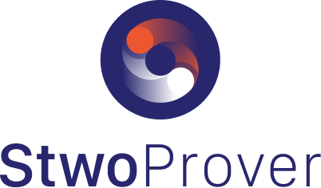

<div align="center">



# Stwo

**A production-grade Circle STARK prover and verifier, written in Rust.**

<a href="https://github.com/starkware-libs/stwo/actions/workflows/ci.yaml"></a>
<a href="https://codecov.io/gh/starkware-libs/stwo"></a>
<a href="https://crates.io/crates/stwo"></a>
<a href="https://github.com/starkware-libs/stwo/blob/main/LICENSE"></a>
<a href="https://starkware.co/"></a>

<p>
  <a href="https://eprint.iacr.org/2024/278"><b>Paper</b></a>
  ·
  <a href="https://starkware-libs.github.io/stwo/dev/bench/index.html"><b>Benchmarks</b></a>
  ·
  <a href="https://github.com/starkware-libs/stwo-cairo"><b>stwo-cairo</b></a>
  ·
  <a href="https://starkware.co/sharp/">SHARP</a>
</p>

</div>

---

## Status

Stwo is **production**. It powers [SHARP](https://starkware.co/sharp/), StarkWare's Shared Prover, which secures
[Starknet](https://starknet.io/) and other STARK-backed systems running on Ethereum. The proving stack on top of
this library generates and submits real proofs, verified on-chain, at scale, every day.

This repository ships the foundational prover and verifier crates. Application-specific provers (for example,
[stwo-cairo](https://github.com/starkware-libs/stwo-cairo) for the Cairo VM) are built on top of these crates and
live in their own repositories.

> Stwo is the next-generation successor to StarkWare's first-generation STARK stack. New deployments should target
> Stwo; legacy systems are progressively migrating onto it.

## Table of Contents

- [Overview](#overview)
- [Highlights](#highlights)
- [Architecture](#architecture)
- [Getting Started](#getting-started)
- [Examples](#examples)
- [Benchmarks](#benchmarks)
- [Ecosystem](#ecosystem)
- [Academic References](#academic-references)
- [Security](#security)
- [Contributing](#contributing)
- [License](#license)

## Overview

**Stwo** (pronounced "stoo") is an implementation of [Circle STARKs][circle-stark-paper] — a STARK proof system
operating natively over the [Mersenne prime](https://en.wikipedia.org/wiki/Mersenne_prime) field
**M31** (`p = 2^31 − 1`). The Mersenne prime enables exceptionally fast 32-bit modular arithmetic on commodity
hardware, while the *circle group* over this field provides the algebraic structure required for FFT-based
polynomial encoding without the smooth multiplicative subgroup that traditional STARK fields rely on.

The result is a proof system that is:

- **Faster on modern CPUs.** M31 arithmetic vectorizes cleanly into 32-bit SIMD lanes (AVX2, AVX-512, NEON,
  WebAssembly SIMD), and the hot paths of the prover are written against these intrinsics.
- **Cheap to verify.** The verifier is `no_std`-compatible and small enough to embed in on-chain environments,
  including Ethereum (Solidity) and Starknet (Cairo).
- **Modular.** A clean separation between the core proof system, the constraint framework, AIR utilities, and
  application logic lets downstream provers compose the pieces they need.

### What is it for?

Anywhere you need a STARK: provable computation, rollups, verifiable VMs, zkVMs, validity proofs, succinct light
clients, attested off-chain computation, and proof aggregation.

## Highlights

- **Circle STARKs over M31.** A complete implementation of the construction described in the [Circle STARK
  paper][circle-stark-paper] and the [Stwo whitepaper][stwo-whitepaper], including the field tower (M31 → CM31 →
  QM31), circle-FFT, the FRI variant adapted for the circle domain, the lifted Merkle commitment scheme, and the
  Fiat-Shamir channel.
- **SIMD-first prover.** A hand-tuned SIMD backend (`backend::simd`) is the primary execution path, with a
  reference CPU backend (`backend::cpu`) used for correctness comparison and platforms without SIMD.
- **`no_std` verifier.** The verifier compiles without `std` and without `prover` — small enough for on-chain
  deployment. A dedicated CI gate (`ensure-verifier-no_std`) enforces this on every commit.
- **Optional parallelism.** Rayon-based parallel proving is gated behind the `parallel` feature.
- **Multiple hash channels.** Blake2s (default), Blake3, Poseidon252 (Starknet-friendly), and a
  Keccak256 channel suitable for Solidity-friendly Fiat-Shamir.
- **GKR + LogUp.** First-class support for [GKR](https://dl.acm.org/doi/10.1145/2699436)-based lookup arguments
  and [LogUp](https://eprint.iacr.org/2022/1530), the building block for efficient memory and table arguments
  in zkVMs.
- **Battle-tested.** The same crates published here run inside SHARP in production.

## Architecture

Stwo is a Cargo workspace. The crates are layered to keep the verifier minimal and the prover composable:

```
crates/
├── stwo/                       # Core library: prover and verifier
│   ├── src/core/               # Verifier-side, no_std compatible
│   │   ├── fields/             #   M31, CM31, QM31 field arithmetic
│   │   ├── circle.rs           #   Circle group, cosets, domains
│   │   ├── fri.rs              #   FRI verifier
│   │   ├── pcs/                #   Polynomial commitment scheme
│   │   ├── channel/            #   Fiat-Shamir channels (Blake2s, Poseidon252, Keccak)
│   │   ├── vcs/, vcs_lifted/   #   Merkle commitments (and lifted variant)
│   │   ├── proof_of_work.rs    #   Grinding
│   │   └── verifier.rs         #   Top-level STARK verifier
│   └── src/prover/             # Prover-side (requires the `prover` feature)
│       ├── backend/cpu/        #   Reference CPU backend
│       ├── backend/simd/       #   Optimized SIMD backend (AVX2/AVX-512/NEON/WASM)
│       ├── fri.rs              #   FRI prover
│       ├── pcs/                #   PCS prover, quotient handling
│       └── lookups/            #   GKR, LogUp, sumcheck
├── constraint-framework/       # DSL and infrastructure for expressing AIR constraints
├── air-utils/                  # Trace construction helpers
├── air-utils-derive/           # Proc macros for AIR ergonomics
├── examples/                   # Reference circuits (Blake, Poseidon2, Fibonacci, PLONK, ...)
└── std-shims/                  # no_std compatibility shims
ensure-verifier-no_std/         # CI-enforced no_std build of the verifier
```

### Design principles

1. **Verifier is sacred.** The verifier path is `no_std`, free of `prover` code, and minimised on purpose. It is
   the only thing on-chain consumers need to reason about; everything else is performance scaffolding.
2. **SIMD is the primary backend.** The CPU backend exists for testing and parity; production proving uses
   SIMD. Performance is treated as a correctness property — regressions are blocking.
3. **Field tower.** Base field M31 → quadratic extension CM31 → quartic extension QM31 (the secure field used
   for Fiat-Shamir challenges). QM31 polynomials are decomposed into four base-field coordinate polynomials for
   commitment and FRI.
4. **Lifted Merkle trees.** The `vcs_lifted` commitment scheme commits to polynomials of multiple sizes in a
   single Merkle tree by lifting smaller polynomials to the largest evaluation domain.
5. **Feature-gated prover.** The `prover` feature gates all proving code so the verifier crate can stay slim.

## Getting Started

### Prerequisites

- Rust nightly. The exact channel is pinned in [`rust-toolchain.toml`](./rust-toolchain.toml); `rustup` will pick
  it up automatically when you build inside the repo.
- A CPU with AVX2 / AVX-512 / NEON for full prover performance. (The CPU backend works without SIMD.)

### Add as a dependency

```toml
[dependencies]
# Verifier only (no_std-compatible)
stwo = { version = "2.2", default-features = false }

# Prover
stwo = { version = "2.2", features = ["prover"] }

# Prover + parallel proving
stwo = { version = "2.2", features = ["prover", "parallel"] }
```

### Build and test

```bash
# Verifier-only build (no_std-compatible)
cargo build --release --no-default-features --package stwo

# Full prover build, single-threaded
cargo build --release --features prover

# Full prover build, parallel
cargo build --release --features "prover,parallel"

# Standard test suite
cargo test --features prover

# Slow / heavy tests
cargo test --release --features "prover,slow-tests"

# Verifier-only tests (no prover dependencies)
cargo test --no-default-features --package stwo

# Confirm the verifier still compiles as no_std
(cd ensure-verifier-no_std && cargo build --release)
```

### Lint and format

```bash
scripts/clippy.sh        # Clippy, all crates, all features
scripts/rust_fmt.sh      # rustfmt
```

### Cargo features

| Feature      | Default | Purpose                                                                       |
|--------------|---------|-------------------------------------------------------------------------------|
| `std`        | yes     | Use `std`. Disable for `no_std` (verifier).                                   |
| `prover`     | no      | Compile the prover-side code. Implies `std`.                                  |
| `parallel`   | no      | Enable Rayon-based parallelism in the prover.                                 |
| `tracing`    | no      | Emit `tracing` spans through the prover for profiling and observability.      |
| `slow-tests` | no      | Enable long-running test cases excluded from the default suite.               |

## Examples

The [`crates/examples`](./crates/examples) crate contains reference circuits demonstrating how to build a
prover on top of Stwo. They are intentionally minimal and meant to be read alongside the source.

| Example          | What it proves                                                       |
|------------------|----------------------------------------------------------------------|
| `wide_fibonacci` | A wide Fibonacci-style trace — the canonical "hello world" of STARKs |
| `poseidon`       | A SIMD Poseidon2 hash chain                                          |
| `blake`          | Blake2s compression (round + scheduler + XOR table)                  |
| `xor`            | A standalone XOR lookup table example                                |
| `plonk`          | A minimal PLONK-style arithmetisation                                |
| `state_machine`  | A two-component state machine illustrating cross-component lookups   |

Run them with:

```bash
cargo test --release --features prover --package stwo-examples
```

## Benchmarks

Criterion benchmarks live in [`crates/stwo/benches`](./crates/stwo/benches) and
[`crates/examples/benches`](./crates/examples/benches). Run them with:

```bash
cargo bench --features prover,parallel
```

To run a single benchmark:

```bash
cargo bench --features prover,parallel --bench fft
```

Continuously-updated benchmark reports for the `dev` branch are published at:

> [**starkware-libs.github.io/stwo/dev/bench**](https://starkware-libs.github.io/stwo/dev/bench/index.html)

### Quick Poseidon2 benchmark

```bash
./poseidon_benchmark.sh
```

This proves `2^18` Poseidon2 permutations end-to-end on a single thread and is a good first-look at
single-machine prover throughput. For a representative number, set `target-cpu=native`.

## Ecosystem

Stwo is the core library. Application-specific provers and integrations live in dedicated repositories:

- **[stwo-cairo][stwo-cairo]** — production prover for the Cairo VM. Powers Cairo program proving in
  StarkWare's stack and is the reference example of a non-trivial prover built on Stwo.
- **[SHARP][sharp]** — StarkWare's Shared Prover service, which uses Stwo to generate proofs deployed to
  Ethereum and other settlement layers.
- **[Starknet][starknet]** — the largest production deployment relying (transitively) on this codebase.

If you have built something on top of Stwo, please open a pull request adding it here.

## Academic References

Stwo implements and extends a line of public cryptographic research. Primary references:

- **Circle STARKs.** Ulrich Haböck, David Levit, Shahar Papini. *Circle STARKs*, IACR ePrint 2024/278.
  [eprint.iacr.org/2024/278][circle-stark-paper]
- **Stwo whitepaper.** Design and engineering of the Stwo prover.
  [`Stwo_Whitepaper/`](./Stwo_Whitepaper/)
- **LogUp.** Ulrich Haböck. *Multivariate lookups based on logarithmic derivatives*, IACR ePrint 2022/1530.
  <https://eprint.iacr.org/2022/1530>
- **GKR / sumcheck.** Goldwasser, Kalai, Rothblum. *Delegating Computation*, STOC 2008.
- **FRI.** Ben-Sasson, Bentov, Horesh, Riabzev. *Fast Reed-Solomon Interactive Oracle Proofs of Proximity*,
  ICALP 2018.
- **Poseidon2.** Lorenzo Grassi et al. *Poseidon2: A Faster Version of the Poseidon Hash Function*, 2023.
  <https://eprint.iacr.org/2023/323>

The implementation follows the published constructions; known deviations between paper and code (parameter
choices, engineering trade-offs, performance specialisations) are documented inside the repository so they
can be reviewed.

## Security

### Reporting a vulnerability

If you believe you have found a security issue in Stwo — and especially anything affecting *soundness*
(a forged proof being accepted, or a valid proof being rejected) — please **do not** open a public GitHub
issue. Report it privately to **security@starkware.co**.

We treat soundness bugs as catastrophic and respond accordingly.

### Audits

External audit reports will be linked here as they are published.

### Threat model and assumptions

- **Soundness.** Circle STARKs as instantiated here are conjectured to be sound under standard cryptographic
  assumptions (collision-resistance of the underlying hash function in the random-oracle model, hardness of
  the small-distance decoding problem implicit in FRI). Soundness error is controlled by the proof
  parameters (blowup factor, number of FRI queries, grinding bits) — these MUST be chosen for the target
  security level by the consumer of this library. Default parameters in tests are **not** production
  security levels.
- **Verifier integrity.** On-chain verifier deployments are downstream of this code. The `no_std` verifier
  here is the reference; deployers are responsible for faithful re-implementation or transpilation.
- **Side channels.** Stwo is not constant-time. It is a public-coin proof system; there are no secrets in
  the prover except, optionally, witness data — which the application is responsible for protecting.

## Contributing

Contributions are welcome. Before opening a non-trivial pull request, please open an issue or discussion
first so we can align on direction.

When contributing:

- Run `scripts/clippy.sh` and `scripts/rust_fmt.sh` locally.
- Add tests for new behaviour. Soundness-critical changes require tests that cover *both* the accept and
  reject paths.
- Keep the verifier `no_std`. The `ensure-verifier-no_std` CI gate will catch regressions.
- Performance changes to the SIMD backend should include a benchmark comparison.

## License

Licensed under the **Apache License, Version 2.0**. See [LICENSE](./LICENSE).

By contributing to this repository, you agree that your contributions will be licensed under the same terms.

[circle-stark-paper]: https://eprint.iacr.org/2024/278
[stwo-whitepaper]: ./Stwo_Whitepaper/
[stwo-cairo]: https://github.com/starkware-libs/stwo-cairo
[sharp]: https://starkware.co/sharp/
[starknet]: https://starknet.io/
